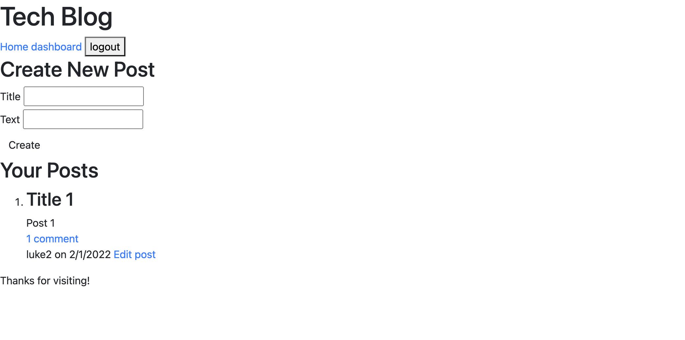

# Tech Blog Backend

## Description
This E-Commerce back end was made in order to show my newly-learned skills with the Model-View-Controller design pattern.

## Table of Contents (Optional)
* [Installation](#installation)
* [Usage](#usage)
* [Credits](#credits)
* [License](#license)
* [Contributing](#contributing)
* [Test](#test)
* [Questions](#questions)

## Installation
Repo can be cloned from my GitHub and dependances can be found in the package.json file.

## Usage
This is what it will look like on your device. 

[Production Link](https://guarded-cliffs-74060.herokuapp.com/)

## Contributing
Luke Johnsen

## Tests 
N/A

## Questions
Please checkout my [Github](https://github.com/lukejohnsen) to see my other projects.